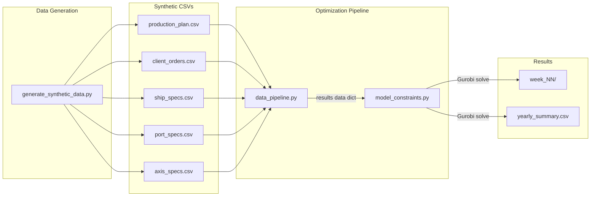
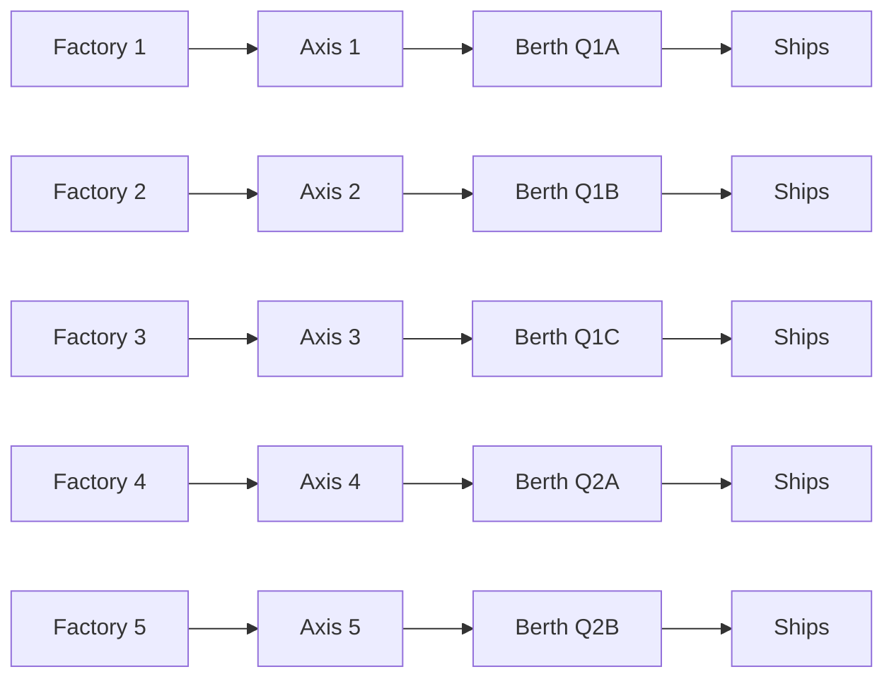

# Port Logistics Optimization

A Mixed-Integer Linear Programming (MILP) model that optimizes weekly vessel scheduling and cargo loading at a multi-berth port. The system generates realistic synthetic logistics data, prepares it for optimization, and solves week-by-week using Gurobi to maximize throughput while minimizing ship turnaround time.
 
## The Problem

A port operator manages **5 factories**, each producing **2 products** (10 products total). These products must be loaded onto visiting cargo ships within strict time windows. The challenge is to schedule which ships berth where and when, balancing three competing objectives:

1. **Maximize loaded cargo** -- every ton loaded is revenue
2. **Minimize ship stay time** -- faster turnaround frees berth capacity
3. **Minimize berth movements** -- repositioning ships is costly and disruptive

The port has **2 quays** with **5 berths** total, connected to factories through a fixed supply chain. Each ship arrives with a loading window (arrival date to deadline) and a specific product demand that must be fulfilled from the designated factory.

## Architecture



## Supply Chain

Products flow through a fixed 1:1:1 chain from factory to ship. Each factory connects to exactly one conveyor axis, which feeds exactly one berth.



Each factory produces 2 products. A ship requesting Product 1 (from Factory 1) can only berth at Q1A. This fixed routing simplifies the optimization significantly -- the solver decides **when** ships berth, not **where**.

## Project Structure

```
Port_Logistics_Optimization/
├── src/
│   ├── scripts/
│   │   ├── generate_synthetic_data.py   # Creates all synthetic CSVs
│   │   ├── data_pipeline.py             # Loads & filters data for a time window
│   │   ├── model_constraints.py         # Gurobi model: variables, constraints, objective
│   │   └── run_model.py                 # Runs the optimizer week-by-week for the full year
│   └── data/
│       ├── synthetic/                   # Generated input CSVs
│       └── results/                     # Optimization results per week
├── pyproject.toml
├── requirements.txt
└── README.md
```

## Synthetic Data

All data is generated by `generate_synthetic_data.py` with built-in feasibility checks.

| File | Description |
|------|-------------|
| `production_plan.csv` | Daily production per factory per product (with seasonality and weekend reduction) |
| `client_orders.csv` | Ship orders with arrival/deadline windows, all contained within single weeks |
| `ship_specs.csv` | 12 ship subclasses (4 types x 3 sizes) with DeadWeight, Length, Draft, LoadingRate |
| `port_specs.csv` | 5 berths across 2 quays with crane and capacity specs |
| `axis_specs.csv` | 5 conveyor axes linking factories to berths |
| `stock_balance.csv` | Daily cumulative production vs. demand per product (verification) |
| `trip_feasibility.csv` | Per-trip check that each ship fits its berth and can load in time |
| `berth_balance.csv` | Daily cumulative berth capacity vs. demand (verification) |

Key design choices in the synthetic data:
- **Week-aligned windows**: Every ship's arrival-to-deadline falls within a single Monday-Sunday week, so the weekly optimizer sees the full loading window
- **Capped at 20 ships/week**: Keeps the model within the Gurobi free license limit (2,000 variables / 2,000 constraints)
- **Demand at 85-92% of production**: Leaves enough production headroom while keeping utilization high
- **Minimum 2,000T per order**: Prevents unrealistically small shipments

## Model Formulation

### Decision Variables

| Variable | Type | Indexed by | Meaning |
|----------|------|------------|---------|
| `at_berth[t,s]` | Binary | day, ship | Ship *s* is at its designated berth on day *t* |
| `at_anchorage[t,s]` | Binary | day, ship | Ship *s* is at anchorage on day *t* |
| `load[t,s]` | Continuous | day, ship | Tons loaded onto ship *s* on day *t* |
| `stock[t,f,p]` | Continuous | day, factory, product | Stock of product *p* at factory *f* at end of day *t* |
| `etb[t,s]` | Binary | day, ship | Ship *s* starts its port stay on day *t* |
| `ets[t,s]` | Binary | day, ship | Ship *s* ends its port stay on day *t* |
| `movement[t,s]` | Binary | day, ship | Ship *s* changed position on day *t* |

### Constraints

All constraints are implemented in `model_constraints.py`. Below is each constraint group, what it enforces, and the mathematical formulation. Sets: *T* = days, *S* = ships, *F* = factories, *P* = products, *B* = berths, *Q* = quays.

#### 1. Demand Limit (`_constr_demand_limit`)

A ship cannot load more cargo than it ordered. The total quantity loaded across all days must not exceed the ship's demand.

```
For each ship s:
    sum(load[t,s] for t in T)  <=  demand[s]
```

#### 2. Ship Position (`_constr_ship_position`)

A ship can be in at most one place (berth or anchorage) at any given time. Outside its laycan window `[arrival, deadline]`, the ship cannot be anywhere in the port.

```
For each ship s, for each day t:
    at_berth[t,s] + at_anchorage[t,s]  <=  1

For each ship s, for each day t outside [arrival_s, deadline_s]:
    at_berth[t,s]     = 0
    at_anchorage[t,s] = 0
```

#### 3. One Ship Per Berth (`_constr_one_ship_per_berth`)

Each berth can accommodate at most one ship on any given day. Since ships are pre-assigned to berths through the fixed chain, this only applies among ships sharing the same berth.

```
For each berth b, for each day t:
    sum(at_berth[t,s] for s assigned to b)  <=  1
```

#### 4. Quay Length (`_constr_quay_length`)

The total length of all ships currently berthed at a quay must not exceed the quay's total available length (sum of its berth lengths). This prevents physical overcrowding even when individual berths have capacity.

```
For each quay q, for each day t:
    sum(ship_length[s] * at_berth[t,s] for s assigned to quay q)  <=  total_quay_length[q]
```

#### 5. Draft Limit (`_constr_draft_limit`)

A ship whose draft exceeds the maximum draft of its designated berth is permanently blocked from berthing. This is checked once at model construction -- if the ship's draft is too deep, `at_berth[t,s]` is forced to 0 for all days.

```
For each ship s where ship_draft[s] > berth_draft[berth_of_s]:
    at_berth[t,s] = 0   for all t
```

#### 6. Loading Rate (`_constr_loading`)

A ship can only load cargo when it is physically at its berth. The daily loading amount is capped by the **effective rate**, which is the minimum of three bottlenecks: the ship's own loading rate, the berth's crane capacity, and the conveyor axis capacity.

```
effective_rate[s] = min(ship_load_rate[s], berth_capacity[b], axis_capacity[a])

For each ship s, for each day t:
    load[t,s]  <=  effective_rate[s] * at_berth[t,s]
```

When `at_berth[t,s] = 0`, the right-hand side is 0, so no loading occurs. When `at_berth[t,s] = 1`, loading is capped at the effective rate.

#### 7. Stock Balance (`_constr_stock_balance`)

Stock at each factory for each product follows a conservation law: today's stock equals yesterday's stock plus today's production minus today's outflow (cargo loaded onto ships). The `stock` variable has a lower bound of 0, so the solver cannot load more than what has been produced.

```
For t = 0 (first day):
    stock[0,f,p] = production[0,f,p] - sum(load[0,s] for s using factory f, product p)

For t > 0:
    stock[t,f,p] = stock[t-1,f,p] + production[t,f,p] - sum(load[t,s] for s using factory f, product p)

stock[t,f,p] >= 0  (enforced by variable bound)
```

#### 8. ETB/ETS Logic (`_constr_etb_ets`)

This is the most complex constraint group. It controls the ship's lifecycle in port using two event variables: ETB (Estimated Time of Berthing) and ETS (Estimated Time of Sailing).

**Single event**: Each ship berths exactly once and sails exactly once.

```
sum(etb[t,s] for t in T) = 1
sum(ets[t,s] for t in T) = 1
```

**Window enforcement**: Both events must occur within the ship's laycan `[arrival, deadline]`.

```
For each day t outside [arrival_s, deadline_s]:
    etb[t,s] = 0
    ets[t,s] = 0
```

**Ordering**: The sailing day must be on or after the berthing day.

```
sum(t * ets[t,s] for t in T)  >=  sum(t * etb[t,s] for t in T)
```

**Presence enforcement**: The ship must be somewhere in port (berth or anchorage) between its berthing and sailing events. This is linearized using cumulative indicators:

```
cum_etb[t] = sum(etb[tau,s] for tau <= t)       -- 1 from berthing day onward
cum_ets[t] = sum(ets[tau,s] for tau <= t)       -- 1 from sailing day onward

For each day t:
    at_berth[t,s] + at_anchorage[t,s]  >=  cum_etb[t] - cum_ets[t-1]    (must be present)
    at_berth[t,s] + at_anchorage[t,s]  <=  cum_etb[t]                    (not before berthing)
    at_berth[t,s] + at_anchorage[t,s]  <=  1 - cum_ets[t] + ets[t,s]    (not after sailing)
```

The first inequality forces presence between ETB and ETS. The second prevents the ship from appearing before berthing. The third prevents the ship from lingering after sailing (allowing presence on the sailing day itself via the `ets[t,s]` correction term).

#### 9. Movements (`_constr_movements`)

Tracks when a ship changes position between consecutive days. A movement is detected when the `at_berth` status flips in either direction (ship moves to berth, or ship leaves berth).

```
For each ship s, for each day t > 0:
    movement[t,s]  >=  at_berth[t,s] - at_berth[t-1,s]     (moved TO berth)
    movement[t,s]  >=  at_berth[t-1,s] - at_berth[t,s]     (moved FROM berth)
```

Since `movement` is binary and the objective penalizes it, the solver sets it to 0 whenever there is no position change and to 1 when a change occurs.

#### Implicitly Satisfied Constraints

Several real-world rules do not need explicit constraints because the fixed 1:1:1 supply chain (Factory -> Axis -> Berth) and the one-ship-per-berth rule inherently satisfy them:

- **A berth loads from at most 1 axis** -- each berth connects to exactly one axis by design
- **A factory conveys from at most 1 axis** -- each factory connects to exactly one axis by design
- **A factory/berth handles one product at a time** -- with one ship per berth and each ship carrying one product, this is automatic

### Objective Function

```
MAXIMIZE:  w_load * TotalLoaded  -  w_stay * TotalStayDays  -  w_move * TotalMovements
```

Default weights: `w_load = 1.0` (primary), `w_stay = 100` (secondary), `w_move = 10` (tertiary). Loading dominates because cargo quantities are in the hundreds of thousands, while stay days and movements are small integers.

## How to Run

**Prerequisites**: Python 3.9+, [uv](https://docs.astral.sh/uv/), Gurobi (free academic/restricted license).

### 1. Generate synthetic data

```bash
source .venv/Scripts/activate    # Windows: .venv\Scripts\activate
uv run src/scripts/generate_synthetic_data.py
```

This creates all CSVs in `src/data/synthetic/` and prints feasibility check results.

### 2. Run the optimizer

```bash
uv run python src/scripts/run_model.py
```

This solves the optimization for each full week (Mon-Sun) of 2025. Partial weeks at the start/end of the year are skipped. Each week's results are saved to `src/data/results/week_NN/`.

### 3. Configuration

Edit the constants at the top of `run_model.py`:

```python
W_LOAD = 1.0      # weight for loading maximization
W_STAY = 100.0     # penalty for stay time
W_MOVE = 10.0      # penalty for movements
TIME_LIMIT = 120   # solver time limit per week (seconds)
MIP_GAP = 0.01     # optimality gap tolerance (1%)
```

## Results

Each weekly folder (`src/data/results/week_NN/`) contains:

| File | Content |
|------|---------|
| `at_berth.csv` | Which ships are at their berth on which days |
| `at_anchorage.csv` | Which ships are at anchorage on which days |
| `load.csv` | Tons loaded per ship per day |
| `stock.csv` | End-of-day stock levels at each factory |
| `etb.csv` | Berthing day per ship |
| `ets.csv` | Sailing day per ship |
| `movement.csv` | Position changes per ship per day |
| `objective.json` | Solver stats, per-ship breakdown, and objective components |

A `yearly_summary.csv` at the top of the results directory aggregates all weeks:

| Column | Meaning |
|--------|---------|
| `week` | Week number (1-53) |
| `ships` | Number of ships in the window |
| `demand` | Total demand (tons) |
| `loaded` | Total loaded (tons) |
| `pct` | Percentage of demand loaded |
| `movements` | Total berth position changes |
| `avg_stay` | Average ship stay duration (days) |
| `status` | `optimal`, `feasible`, `skipped`, or `license_limit` |

The yearly run in `run_model.py` also creates two consolidated detail tables in `src/data/results/`:

| File | Content |
|------|---------|
| `ships_summary.csv` | One row per ship with ETB/ETS dates and per-ship outcome (`ship`, `etb`, `ets`, `berth`, `product`, `demand`, `loaded`, `pct_loaded`) |
| `loading_summary.csv` | One row per ship-day at berth with daily and cumulative loading (`date`, `ship`, `load`, `berth`, `product`, `demand`, `cumulative_load`, `cumulative_load_pct`) |

These are computed directly from weekly outputs (`at_berth.csv`, `etb.csv`, `ets.csv`, `load.csv`, `objective.json`) so no separate notebook step is required.

### Sample Performance

With default settings across a full year:

- **51 weeks optimized** (2 partial weeks skipped)
- **98.9% overall loading** -- nearly all demand fulfilled
- **Every solved week loads 95%+** of demand
- All models solved to optimality in under 1 second each
- No Gurobi license limit breaches (max ~1,100 constraints per week)
